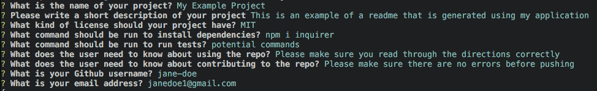
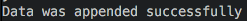

# Readme-Generator

## Description 
This repository contains the code used to create a README generator. The generator allows any developer to easily create and format a professional README for a new project. The 'EXAMPLE.md' serves as a sample README file generated using the readme-generator application.

## Technologies
Project is coded in:
* Javascript
* Node.js

Dependencies:
* [Inquirer package](https://www.npmjs.com/package/inquirer)

## Installation
In order to install necessary dependencies, please run the following command:
npm i inquirer

## Functionality
The Readme-Generator is initialized when the user runs the command "node index.js" in the terminal. From there, the user will be prompted with a series of questions regarding the details of their project. Once finished, their answers will be logged and written to a new readme file. The file contains a Description, Table of Contents, Installation, Usage, Contributing, Tests, and Questions section for easy navigation. 

## Preview

Command to initialize program

Examples of questions user will be prompted

User response

Terminal will display this message if file was successfully written

### Links
[Link to walkthrough video](https://github.com/ma-wong/Readme-generator)

